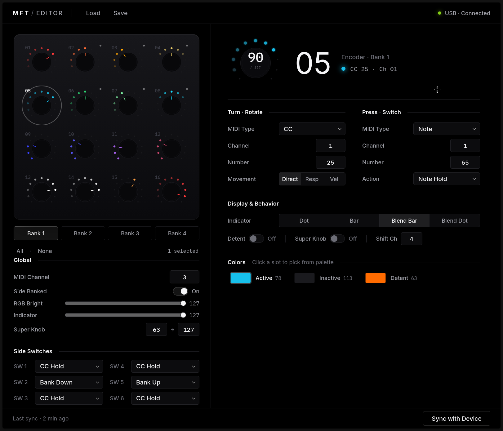

# MFT Editor

[](https://github.com/BrettKinny/mft-editor/actions/workflows/python.yml)
[](https://github.com/BrettKinny/mft-editor/actions/workflows/web.yml)
[](LICENSE)
[](#%EF%B8%8F-v01--early-tester-release)

A Linux-first editor for the [DJ Tech Tools MIDI Fighter Twister](https://store.djtechtools.com/products/midi-fighter-twister) — configure encoders, colours, banks, and side switches without needing Windows or macOS. Ships in two flavours that share a byte-exact protocol layer: a **PySide6 desktop app** and a **Svelte web app** that runs anywhere Web MIDI does.



---

## ⚠️ v0.1 — early tester release

This is an **early-tester release**. Expect rough edges, missing polish, and the occasional bug.

- **Tested only on Linux.** Cross-platform support is on the [v1.0 roadmap](#roadmap-toward-v10) — not a current promise.
- **The web build is experimental** and Chromium-only (Chrome, Edge, Brave, Arc, Opera). Firefox and Safari don't ship Web MIDI.
- Found something weird? [Open an issue](../../issues) — that's what gets this to a stable release.

**Hardware safety.** The editor only sends standard config SysEx that the official MF Utility also sends. There is no firmware-update or flash-erase code path anywhere in this codebase. Worst case, a bad mapping is recoverable in two clicks via **Tools → Factory Reset**.

**Not affiliated with DJ TechTools.** "MIDI Fighter Twister" and "DJ Tech Tools" are trademarks of DJ TechTools — this is a community project that talks to their hardware over the public MIDI/SysEx interface.

---

## Quickstart

### Desktop (Linux, Python 3.10+)

```bash
uv sync
uv run mft-editor
```

Or with pip:

```bash
pip install -e .
mft-editor
```

### Web (Chromium-based browser)

```bash
cd web
pnpm install
pnpm dev
```

Open the URL Vite prints and authorise Web MIDI when prompted.

---

## Features

- All **16 encoders × 4 banks** (64 unique controls)
- Per-encoder MIDI: separate **turn** and **press**, with channel, number, and type (Note, CC, Relative Encoder, Switch Velocity Control, Mouse Drag, Mouse Scroll)
- Movement modes — Direct, Responsive, Velocity-Sensitive
- Indicator display types — Dot, Bar, Blended Bar, Blended Dot
- **Active / Inactive / Detent** colour per encoder from the full 128-colour firmware palette
- Detent flag, super-knob flag, shift-channel routing
- Global settings — MIDI channel, RGB + indicator brightness, side-banked mode, super-knob range
- All **6 side switches** with every action the firmware supports (CC/Note Hold & Toggle, Shift Pages, Bank Up/Down/1–4/Cycle)
- **Pull** current state from the device, **Push** edits back, **Save/Load** presets to disk

## Repository layout

| Path | What lives here |
|------|-----------------|
| [`mft_editor/`](mft_editor/) | PySide6 (Qt) desktop editor — talks to the device over ALSA / `python-rtmidi`. |
| [`web/packages/app/`](web/packages/app/) | Svelte + TypeScript web editor. Runs in any Chromium-based browser with Web MIDI. |
| [`web/packages/core/`](web/packages/core/) | Shared protocol layer: encoder / global config types, SysEx encode/decode, colour palette. Consumable by other tooling. |
| [`web/design-mockups/`](web/design-mockups/) | Single-file HTML prototypes — `d-focused.html` is the basis for the screenshot above. |
| [`docs/twister-reference.md`](docs/twister-reference.md) | Distilled protocol & hardware reference, linked back to DJTT's official docs. |
| [`examples/`](examples/) | Sample `mft-editor-v1` JSON presets you can import. |

The desktop and web editors deliberately implement the **same protocol from a single byte-exact spec** — round-trip parity is enforced by shared fixtures (`tests/fixtures/*.json` exercises both Python and TypeScript).

## Roadmap toward v1.0

- [ ] Verified macOS + Windows support for the desktop editor
- [ ] Non-blocking device pull (current pull blocks the UI thread for ~10–20 s)
- [ ] Per-encoder progress indicator during push
- [ ] In-app diagnostics / log file
- [ ] Real-device verification matrix for the web build (Chrome / Edge / Brave / Arc)

## Contributing

Bug reports, repro recipes, and patches are all welcome. If you're adding to the protocol layer, please add a fixture under [`tests/fixtures/`](tests/fixtures/) so both the Python and TypeScript implementations stay in sync.

```bash
# Python
uv run pytest

# Web
cd web && pnpm test && pnpm typecheck
```

## License

[LGPL-3.0-or-later](LICENSE). The full GPL-3.0 text it incorporates lives in [`LICENSE.GPL`](LICENSE.GPL).
